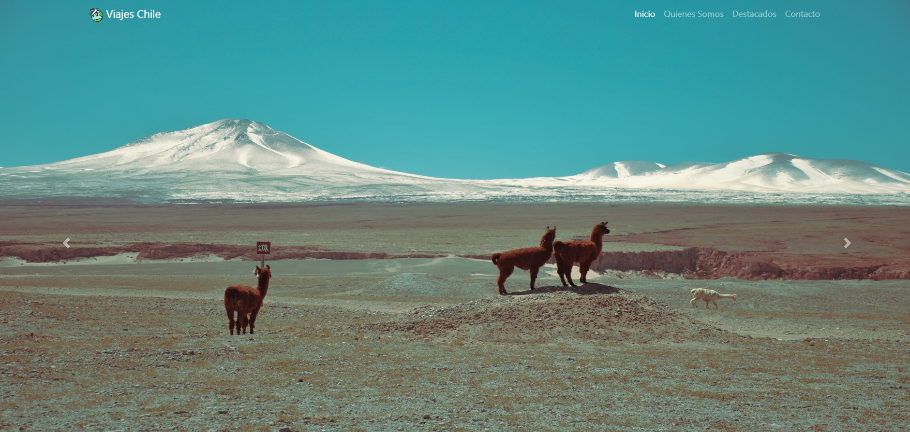

# Viajes Chile

Página creada con el fin de dar a conocer los distintos lugares turísticos de nuestro país.

	

## Las herramientas utilizadas son las siguientes: 

- Bootstrap 4.6
- FontAwesome 5

## Puesta en marcha

Para ver la página, puedes hacer lo siguiente: 

1. Clona este repositorio.
2. Abre el archivo `index.html` con tu navegador.

O también puedes acceder a ella desde el siguiente [link](https://diegoperez24.github.io/prueba_viajes_chile/)
